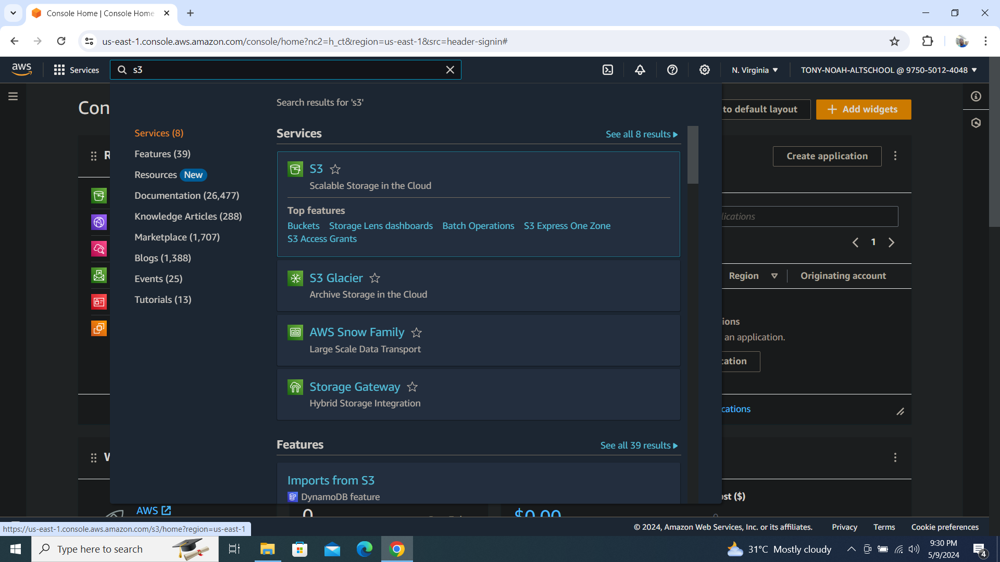

# we are hosting a static website on aws s3 bucket and also delivering the content using CloudFront

## According to aws cloudfront documentation, the importance of cloudfront is that `Amazon CloudFront speeds up distribution of your static and dynamic web content, such as .html, .css, .php, image, and media files. When users request your content, CloudFront delivers it through a worldwide network of edge locations that provide low latency and high performance.`

## Requirements for this to be possible
1. An Aws Account with an IAM user who has the permission to spin up s3 and cloudfront resources.
2. Your html files that you want to host. 

STEPS ARE AS FOLLOW

1. `After you must have logged into your aws account, search for s3 as you can see from the image below`

2. `click on create bucket as you can see from the image below`

3. `then fill up the informations that are required as shown below and click on create bucket`
.PNG)
4. `After it must have been created successfully, it will take you to this page, where you can see your bucket`
.PNG)
5. `click on the bucket and open it`
.PNG)
6. `click on add folder to upload the objects you want to render as a static webpage`

7. `once that has been done successfully, you will see a page like this`
.PNG)
8. `click on the folder and open it`

9. `once it is open, we want to move the contents of the folder into the root directory of the bucket, and we would do that by selecting all the objects in the folder`
.PNG)
10. `after selecting all the objects, we would now click on action, then select move`
.PNG)
11. `next step is to select where we want to move our objects to, click on the browse s3, it will prompt you to select the s3 bucket name, then scroll down and select destination`
.PNG)
12. `after you must have clicked on the bucket name, click on choose destination`

13. `after you choose destination, scroll down and click on move`
.PNG)
14. `once it is successful, you will see a screen like this`
.PNG)
15. `so if you click on your bucket name now, you will that all your objects are residing in the root directory of your bucket now`
.PNG)
16. `Now we would want to enable the static webpage, so we would click on our bucket and go to the properties tab, click on it and scroll down till you see static web hosting, click on edit, then on enable, then select the hosting type as static website, then under the index document, type index.html, this will be the landing page for our static website`
.PNG)
.PNG)
.PNG)
.PNG)
17. `After you must have saved your settings, go back to the properties tab again and scroll down, you will see that you have a link now to access your webpage`
.PNG)
18. `next is to go to our permission tab, so we can set up public access to the public, edit the block public access and disable it and click on save changes`
.PNG)
.PNG)
19. `Next is to add bucket policy under the same permission tab, so that our objects can be accessible using the link that is attached to the bucket, we would edit the bucket policy by clicking on edit, then click on add new statement, then in the bar, type s3, select the s3, after this search for Getobject(the getobject is instructing the link to get that object inside of the bucket and in our case here it is the index.html), for the principle we would add "*" this line means the access is open to everyone, then the line for the resources is our bucket details you can easily copy that and paste it there, then save the configuration`
.PNG)
.PNG)
.PNG)
.PNG)
.PNG)
.PNG)
20. `we can go and copy the url that was given to us when we enable the static website hosting and paste it on the browser to see if our page is now rendering and we can see it is working now`
.PNG)
21. `so the next step now is to go create our cloudfront, we would do that by searching for cloudfront, select it`
.PNG)
22. `it will take you to this page, click on create a cloud front distribution`

23. `then click on the origin domain, it will automatically list the services you want to use, select the s3 bucket name that is there, then make sure you click that use website endpoint, after that scroll down, you can either enable or disable your firewall, there is also a tab to add your custom domain if you have any, but since we dont have, we would leave our as the default, then scroll down and click on create distribution`
.PNG)
.PNG)
.PNG)
.PNG)
.PNG)
24. `if it is successfull, we would get a screen like this`
.PNG)
25. `we would now copy the distribution domain name that has been generated by cloud front for us and test it in our browser to see if cloud front is now rendering our page. it is worthy of note that it wont work immediately, it might take a min or two before the link would work. so from the image below, you can see that our static webpage is now been rendered by cloud front using the domain name`
.PNG)

In conclusion, these are just the steps to render our static webpage on aws s3 bucket using cloudfront